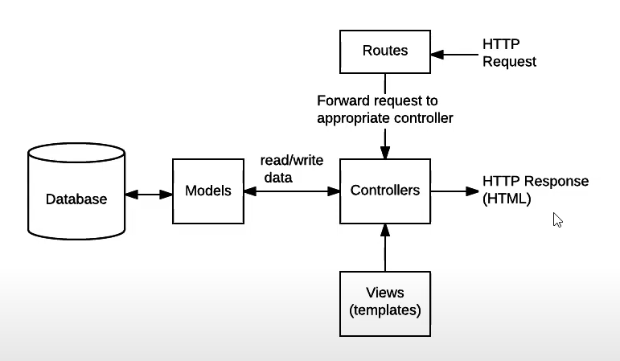

<h1 align="center"><b>MVC com MySQL e NodeJS</b></h1>

As palavras chaves para este projeto (de estudo) são: MVC, POO, CRUD, MySQL e Node.JS. Possui uma boa estrutura de pastas (em MVC). Um bom repositório para entender um pouco dessa arquitetura e talvez usar em projetos básicos e pequenos

<div align="center">
  
  <p>Arquitetura MVC e protocolos HTTP</p>
</div>

<h2>Instalações necessárias</h2>

```SH
//dependências
npm i express mysql2 body-parser sequelize

//dependências de desenvolvimento
npm i nodemon -D
```

<h2>Run</h2>

```SH
npm run dev
```

<h2>Obrigado</h2>

Disponibilizado com ❤ por [pratesMatheus](https://github.com/pratesMatheus "pratesMatheus").
